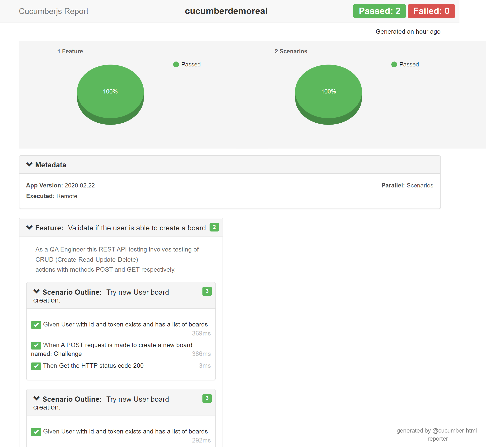

<h1>QA Engineer - Trello Challenge</h1>

In this e2e project, we are providing examples of how we can automate some testing scenarios involving CRUD actions.

We are going to show how we implemented the following scenarios:

<ul>
<li>Create a board</li></ul>

## Clone and Install
</br>
<ul>
    <li>@cucumber/cucumber</li>
    <li>chai</li>
    <li>cucumber-html-reporter</li>
    <li>axios</li>
</ul>
</br>

```bash
npm i
```
</br>

## Test Objectives
</br>
The objective of the test is to verify that the functionality of https//api.trello.com/ works according to the specifications. You have a ODS document with all the test scenarios & cases.
</br>
</br>
The test will execute and verify the test scripts, identify, fix and retest all high and medium severity defects per the entrance criteria.
</br>
</br>

### Functional Testing 

</br>

<p>During Functional testing, testing team will use preloaded data which is available on the system at the time of execution</p>
</br>


## Run Test
</br>
<p>You can run the test with the following command</p>
</br>

```bash
npm run e2e-test
```
</br>

<p>You have the report in JSON format at the folder e2e-test-reports</p>

</br>

## Test Report
</br>

<p> After running the test you can make a HTML report with the following comand</p>

</br>

```bash
node index.js
```
</br>
<p> And the report is created in HTML format at the following path </p>
</br>

```bash
e2e-test-reports\cucumber_report.html
```
</br>

